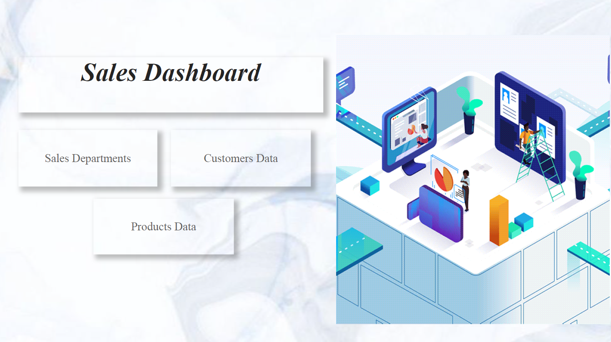
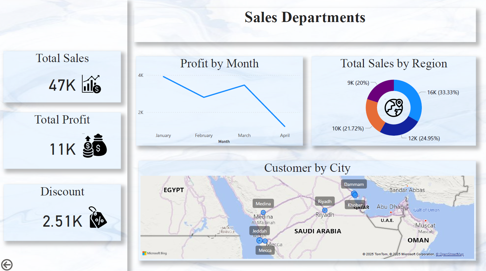
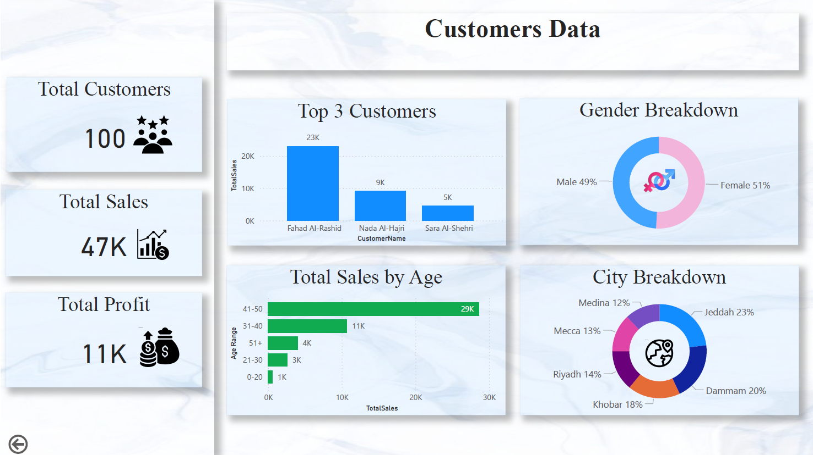
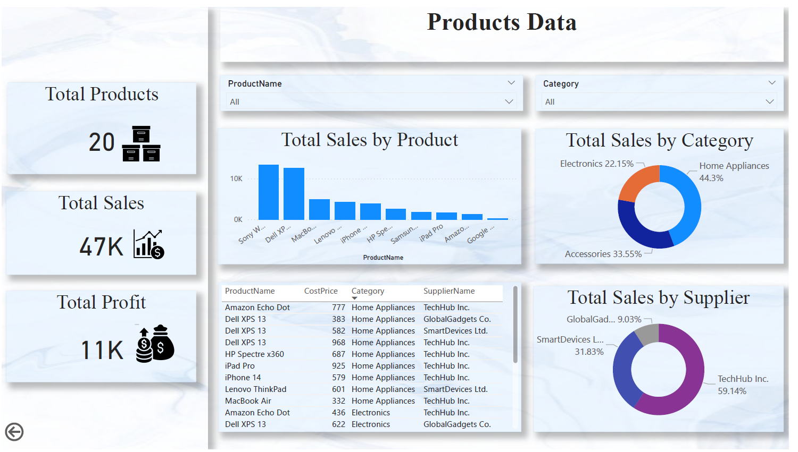

# Sales Insights Project

## Project Description
This project, named **Sales Insights Project**, utilizes a pre-prepared dataset to analyze the sales performance of a company operating in the sales sector using **Power BI**. The analysis focuses on sales, customers, and product data to provide actionable insights that support strategic decision-making and performance improvement.

## Objectives
1. **Sales Performance Analysis**:
   - Evaluate sales performance by regions.
   - Study customer behavior based on age groups.
2. **Identify Top Products and Suppliers**:
   - Determine the best-selling products.
   - Identify the most efficient suppliers.
3. **Improve Marketing and Sales Strategies**:
   - Provide recommendations to enhance strengths.
   - Address weaknesses to improve overall performance and increase revenue.

## Key Deliverables
- Interactive dashboards and visualizations displaying:
  - Sales performance by regions and demographics.
  - Best-performing products and suppliers.
  - Key metrics such as revenue and profit.
- Recommendations based on the provided dataset analysis.

## Tools Used
- **Power BI Desktop** for data visualization and reporting.
- **Excel** for initial data preparation (Excel file not included for privacy reasons).
- **GitHub** for project sharing and documentation.

## How to Use the Project
1. Download the **.pbix** file from this repository to explore the Power BI analysis.
2. Use [Power BI Desktop](https://powerbi.microsoft.com/desktop/) to open the .pbix file and explore the interactive dashboards.

## Project Files
- sales_insights.pbix: Power BI file containing the interactive dashboards.
- README.md: Project documentation file.

## Screenshots

### Sales Dashboard
This is the main page of the dashboard, providing an overview of the sales performance and navigation to the detailed pages.

### Sales Departments
This page analyzes sales performance across different departments, highlighting key metrics such as revenue and profit.

### Customers Data
This page focuses on customer demographics and behavior, including age groups and purchasing trends.

### Products Data
This page highlights the most popular products and their suppliers, helping identify top-performing categories.

